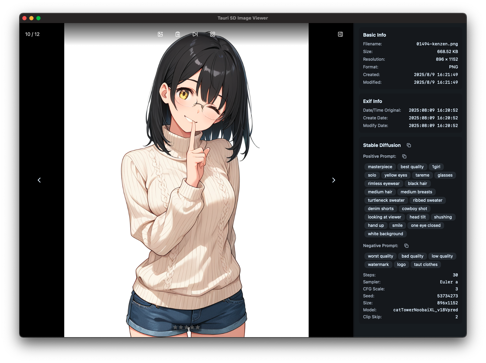
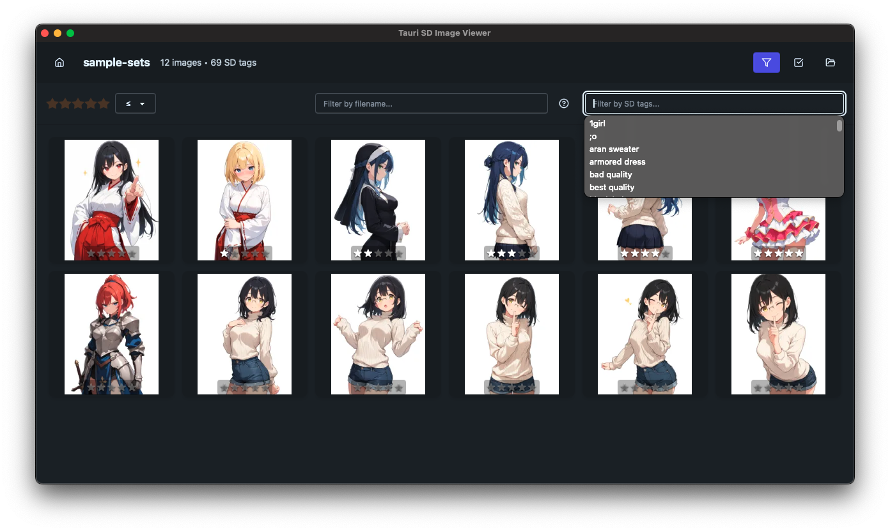

# Tauri SD Image Viewer


_[English🌐](README.md) | 日本語🇯🇵_

Tauri v2で構築されたデスクトップ画像ビューアーアプリケーション。Stable Diffusionのメタデータ表示と管理に特化しています。

## ダウンロード

[Releasesページからどうぞ。](https://github.com/tenpaMk2/tauri-sd-image-viewer2/releases)

## スクリーンショット

### 単一画像表示


Stable Diffusionパラメータを含む詳細なメタデータとともに画像を表示

### グリッド表示


レーティングシステムとSDタグフィルタリング機能を持つサムネイルグリッドで画像を閲覧

🚧 SDタグフィルタリングは対応中 🚧

## 機能

- **画像表示**: PNG形式をサポート
- **Stable Diffusionメタデータ表示**: 生成画像からSDパラメータを抽出・表示
- **レーティングシステム**: 星評価で画像を評価（XMPメタデータに書き込み。Exif非対応。）
- **キーボードナビゲーション**: <kbd>←</kbd><kbd>→</kbd>キーで画像間を移動。<kbd>1</kbd>~<kbd>5</kbd>でレーティング
- **サムネイルグリッド**: グリッドレイアウトで画像を閲覧
- ~~**SDタグフィルタリング**: Stable Diffusionタグで画像をフィルタリング~~ 🚧 対応中 🚧
- **クロスプラットフォーム**: macOSとWindowsで動作

## 技術スタック

- **アプリケーションビルド**: Tauri v2、Bun
- **フロントエンド**: Svelte 5（SvelteKit）、TypeScript、Tailwind CSS 4、DaisyUI
- **バックエンド**: Tauri v2（Rust）

## 開発

### 前提条件

- [Bun](https://bun.sh/) - JavaScript ランタイム・パッケージマネージャー
- [Rust](https://rustup.rs/) - Tauriバックエンドに必要
- [Build Tools for Visual Studio](https://visualstudio.microsoft.com/ja/downloads/?q=build+tools) - Windowsのみ。XMP系ライブラリの使用に必要。

### はじめに

1. リポジトリをクローン:

```bash
git clone https://github.com/tenpaMk2/tauri-sd-image-viewer2.git
cd tauri-sd-image-viewer2
```

2. 依存関係をインストール:

```bash
bun install
```

3. 開発サーバー起動:

```bash
bun run tauri:dev
```

### ビルドコマンド

- `bun run tauri:dev` - 開発サーバー起動（フロントエンド + Tauriアプリ）
- `bun run tauri:build` - Tauriアプリプロダクションビルド
- `bun run dev` - フロントエンドのみ開発サーバー起動
- `bun run build` - フロントエンドのみビルド
- `bun run check` - TypeScript型チェック実行
- `bun run format` - Prettierでコード整形

### 推奨開発フロー

1. 開発開始: `bun run tauri:dev`
2. コードを変更
3. 型チェック実行: `bun run check`
4. コミット前にコード整形: `bun run format`

## 画像形式対応

| 形式     | 機能                                                |
| -------- | --------------------------------------------------- |
| **PNG**  | フルサポート: SDメタデータ、XMPレーティング書き込み |
| **JPEG** | 🚧 対応中 🚧                                        |
| **WebP** | 🚧 対応中 🚧                                        |

## ライセンス

MIT License - 詳細は[LICENSE](LICENSE)ファイルを参照してください。

## 貢献

[GitHub](https://github.com/tenpaMk2/tauri-sd-image-viewer2/issues)でのIssueやPull Requestを歓迎します。

# TODO

- SDタグのカスタムアイコン付与
- SDタグフィルタリング
- Gridでの自動リロード
- Gridでの優先的サムネイル＆メタデータロード
- Viewer表示でのサムネイル作成開始
- ディレクトリ更新時に不要サムネイルチェックと破棄。
- JPEGとWebPサポート
- <kbd>l</kbd> (Last) で自動ナビゲーション開始
