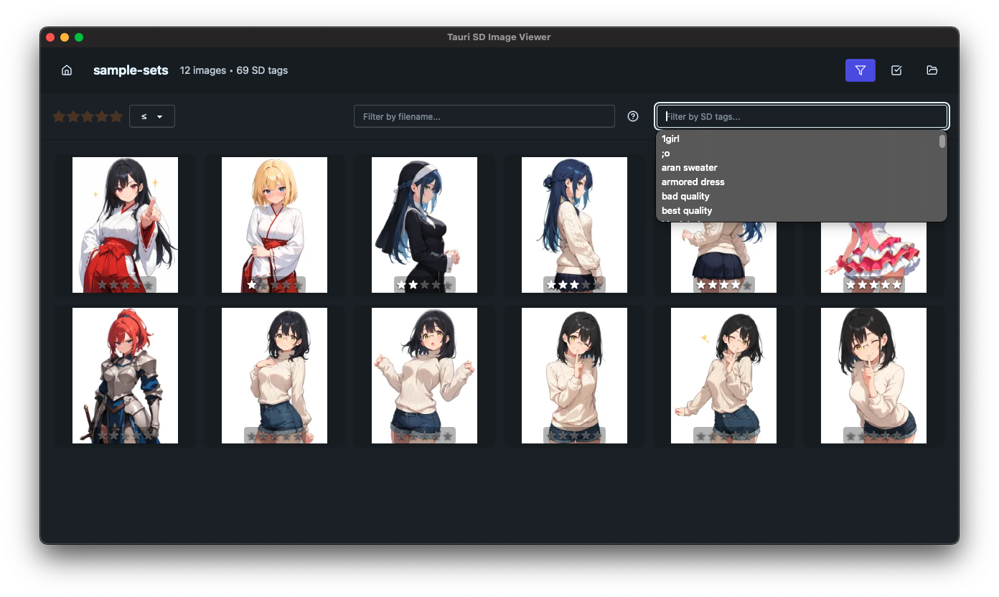

# Tauri SD Image Viewer


_English🌐 | [日本語🇯🇵](README.ja.md)_

A desktop image viewer application built with Tauri v2, specifically designed for viewing and managing images with Stable Diffusion metadata.

## Screenshots

### Single Image View


_View images with detailed metadata including Stable Diffusion parameters_

### Grid View

🚧 Work in Progress 🚧


_Browse images in thumbnail grid with rating system and SD tag filtering_

## Features

- **Image Viewing**: Support for PNG format
- **Stable Diffusion Metadata**: Extract and display SD parameters from generated images
- **Rating System**: Rate images with star ratings (writes to XMP metadata, not EXIF)
- **Keyboard Navigation**: Navigate images with <kbd>←</kbd><kbd>→</kbd> keys, rate with <kbd>1</kbd>~<kbd>5</kbd>
- ~~**Thumbnail Grid**: Browse images in a grid layout~~ 🚧 Work in Progress 🚧
- ~~**SD Tag Filtering**: Filter images by Stable Diffusion tags~~ 🚧 Work in Progress 🚧
- **Cross-Platform**: Works on macOS and Windows

## Technology Stack

- **Application Build**: Tauri v2, Bun
- **Frontend**: Svelte 5 (SvelteKit), TypeScript, Tailwind CSS 4, DaisyUI
- **Backend**: Tauri v2 (Rust)

## Development

### Prerequisites

- [Bun](https://bun.sh/) - JavaScript runtime and package manager
- [Rust](https://rustup.rs/) - Required for Tauri backend
- [Build Tools for Visual Studio](https://visualstudio.microsoft.com/downloads/?q=build+tools) - Windows only, required for XMP libraries

### Getting Started

1. Clone the repository:

```bash
git clone https://github.com/tenpaMk2/tauri-sd-image-viewer2.git
cd tauri-sd-image-viewer2
```

2. Install dependencies:

```bash
bun install
```

3. Start development server:

```bash
bun run tauri:dev
```

### Build Commands

- `bun run tauri:dev` - Start development server (frontend + Tauri app)
- `bun run tauri:build` - Build production Tauri app
- `bun run dev` - Start frontend-only development server
- `bun run build` - Build frontend only
- `bun run check` - Run TypeScript type checking
- `bun run format` - Format code with Prettier

### Recommended Development Flow

1. Start development: `bun run tauri:dev`
2. Make changes to the code
3. Run type checking: `bun run check`
4. Format code before commit: `bun run format`

## Image Format Support

| Format   | Features                                               |
| -------- | ------------------------------------------------------ |
| **PNG**  | Full support: SD metadata, XMP rating writing         |
| **JPEG** | 🚧 Work in Progress 🚧                                 |
| **WebP** | 🚧 Work in Progress 🚧                                 |

## License

MIT License - see [LICENSE](LICENSE) file for details.

## Contributing

Issues and pull requests are welcome on [GitHub](https://github.com/tenpaMk2/tauri-sd-image-viewer2/issues).

# TODO

- Grid view support
  - Focus on viewed image when returning from single view to grid view
- Check and discard unnecessary thumbnails when directory is updated
- JPEG and WebP support
